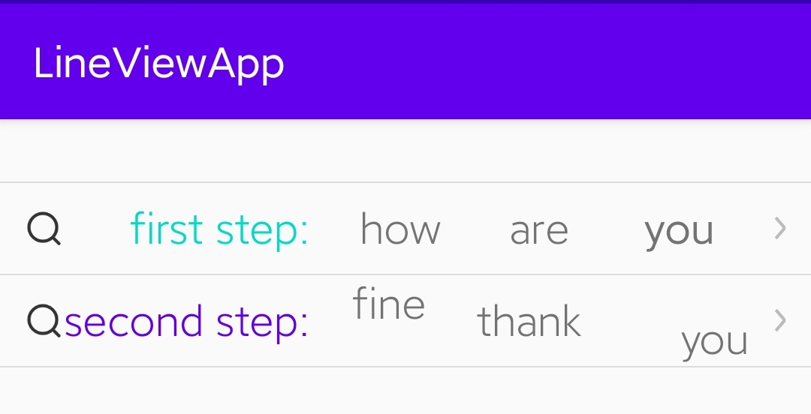

# android
android library collection use in daily work


# [line-view](./line-view) 
<p>
    <a href="https://jitpack.io/#foolishchow/android/line-view">
        
    </a>
</p>

```gradle
implementation 'com.github.foolishchow.android:line-view:@version'
```

<p>
    
</p>


# [subscripted-text-view](./subscripted-text-view)
<p>
    <a href="https://jitpack.io/#foolishchow/android/subscripted-text-view">
        
    </a>
</p>

```gradle
implementation 'com.github.foolishchow.android:subscripted-text-view:@version'
```

<p>
    
</p>

# [date-picker](./date-picker) 
<p>
    <a href="https://jitpack.io/#foolishchow/android/date-picker">
        
    </a>
</p>

```gradle
implementation 'com.github.foolishchow.android:date-picker:@version'
```

<p>
    
</p>

