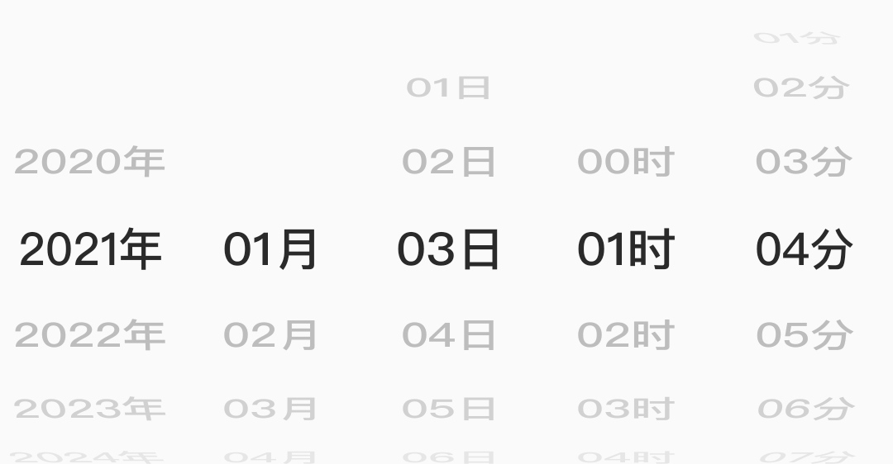

# DatePicker




## use
[ ]
(https://jitpack.io/#foolishchow/android/date-picker)

```gradle
implementation 'com.github.foolishchow.android:date-picker:@version'
```

## sample code
```xml
<me.foolishchow.android.datepicker.DateWheelView
            android:id="@+id/year"
            android:layout_width="0dp"
            android:layout_height="wrap_content"
            android:layout_weight="1"
            android:fontFamily="@font/pingfang_medium"
            android:label="年"
            android:textSize="20sp"
            android:value="2000"
            app:line_spacing_multiplier="2"
            app:max="2010"
            app:text_x_offset="1"
            app:min="1990"
            tools:ignore="HardcodedText" />

```
