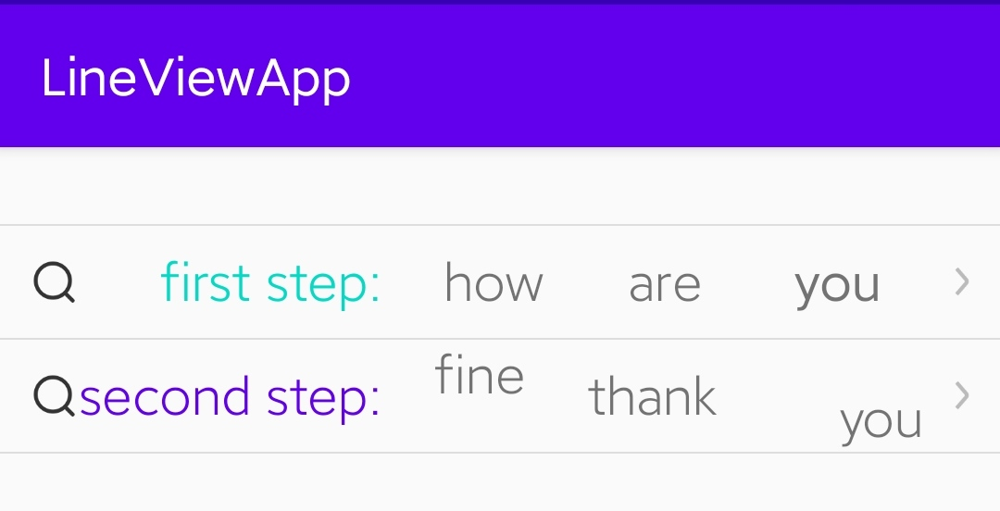

LineView



## use
[ ]
(https://jitpack.io/#foolishchow/android/line-view)

```gradle
implementation 'com.github.foolishchow.android:line-view:@version'
```

## sample code
- LinearLineView
```xml
<me.foolishchow.android.widget.LinearLineView
        android:layout_width="match_parent"
        android:layout_height="wrap_content"
        android:paddingLeft="12dp"
        android:paddingRight="12dp"
        app:border_bottom_color="#dddddd"
        app:border_bottom_width="2px"
        app:border_top_color="#dddddd"
        app:border_top_width="2px"
        app:lv_content_height="44dp"
        app:lv_label="first step:"
        app:lv_label_align="end"
        app:lv_label_color="@color/colorAccent"
        app:lv_label_text_size="20dp"
        app:lv_label_width="120dp"
        app:lv_left_icon="@mipmap/line_view_icon_common_search_drak"
        app:lv_right_icon="@mipmap/line_view_icon_common_right"
        tools:ignore="PxUsage">

    </me.foolishchow.android.widget.LinearLineView>

```

- RelativeLineView
```xml
<me.foolishchow.android.widget.RelativeLineView
        android:layout_width="match_parent"
        android:layout_height="wrap_content"
        android:paddingLeft="12dp"
        android:paddingRight="12dp"
        app:border_bottom_color="#dddddd"
        app:border_bottom_width="2px"
        app:lv_content_height="44dp"
        app:lv_label="second step:"
        app:lv_label_align="end"
        app:lv_label_color="@color/colorPrimary"
        app:lv_label_text_size="20dp"
        app:lv_label_width="120dp"
        app:lv_left_icon="@mipmap/line_view_icon_common_search_drak"
        app:lv_right_icon="@mipmap/line_view_icon_common_right"
        tools:ignore="PxUsage">

    </me.foolishchow.android.widget.RelativeLineView>
```

## custom
extend `me.foolishchow.android.widget.BaseLineVie` and make your own LineView , for example `ConstraintLayout`
