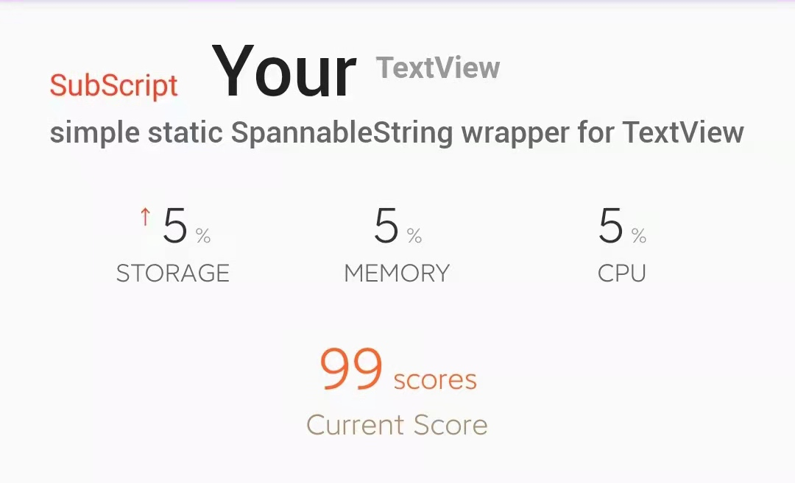

# SubScriptedTextView


   

## use
[ ]
(https://jitpack.io/#foolishchow/android/subscripted-text-view)

```gradle
implementation 'com.github.foolishchow.android:subscripted-text-view:@version'
```

## sample code
```xml
<me.foolishchow.android.subscripted.SubScriptedTextView
            android:id="@+id/focus_sub_pause_times"
            android:layout_width="0dp"
            android:layout_height="wrap_content"
            android:layout_weight="1"
            android:text="5"
            android:textAlignment="center"
            android:textColor="#333333"
            android:textSize="24sp"
            app:ss_bottom_text="STORAGE"
            app:ss_bottom_text_color="#666666"
            app:ss_bottom_text_size="12dp"
            app:ss_left_font_family="@font/file_roboto_medium"
            app:ss_left_text="↑ "
            app:ss_left_text_align="top"
            app:ss_left_text_color="#FF3F25"
            app:ss_left_text_size="10dp"
            app:ss_right_text=" %"
            app:ss_right_text_color="#999999"
            app:ss_right_text_size="10dp"
            tools:ignore="HardcodedText" />

```
